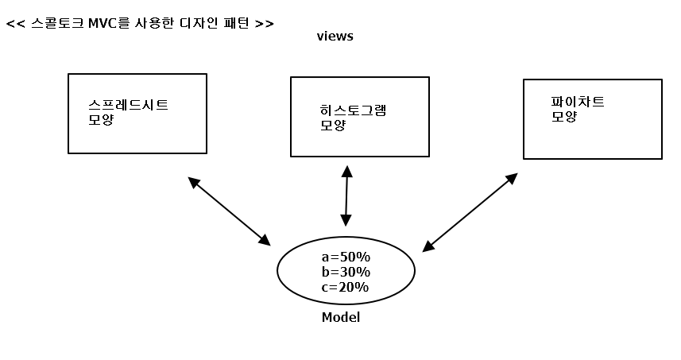

# 1.2스몰토크 MVC를 사용한 디자인 패턴

MVC가 갖는 디자인 패턴  
- M(Model) : 응용프로그램 객체
- V(View) : 스크린에 모델을 디스플레이하는 방법
- C(Controller) : 사용자 인터페이스가 사용자 입력에 반응하는 방법

=> 한 개의 모델과 이 모델을 표현하는 세 가지 뷰를 보여줌(간략히 하기 위해 Controller 생략)  

=> 한 객체에서 일어난 변경을 다른 객체들에 반영하도록 별도의 객체를 둠으로써, 변경이 일어난 객체는 변경 반영이 필요한  
  다른 객체들을 알 필요가 없게끔 객체를 분리 -> *감시자 패턴*  
  
=> 단일 객체처럼 복합 객체를 사용하고 싶을 때, 이런 일반적 설계를 담는 것이 -> *복합체 패턴* 
  ( 복합 뷰를 마치 하나의 단일 뷰와 동일한 것처럼 사용하려는 설계 개념 )   
  
=> 특정 대응 전략을 구현하기 위해 View 클래스가 Controller 서브클래스의 인스턴스를 사용한다면, 다른 전략을 구현하기 위해 현재의 컨트롤러  
   인스턴스를 다른 종류의 컨트롤러 인스턴스로 대체만 하면 됨 -> *전략 패턴*  
   
   
MVC에서 뷰와 컨트롤러 관계를 맺어주는 데 주로 쓰이는 패턴은 : 감시자, 복합체, 전략 패턴  
( 팩토리 메소드 패턴을 이용해서 뷰에 대한 기본 컨트롤러 클래스를 지정 or 장식자 패턴을 이용해서 뷰에 스크롤을 추가 등 도 있으나)

   
     
   
  
  
