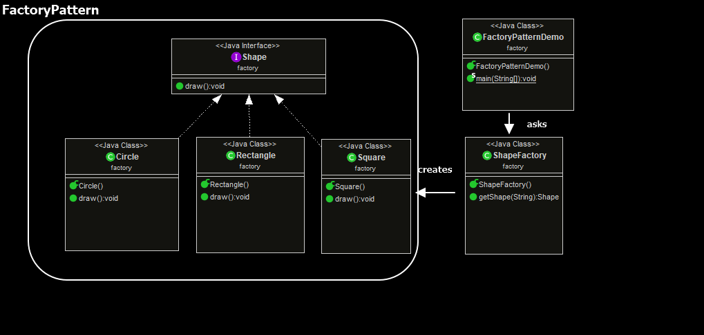
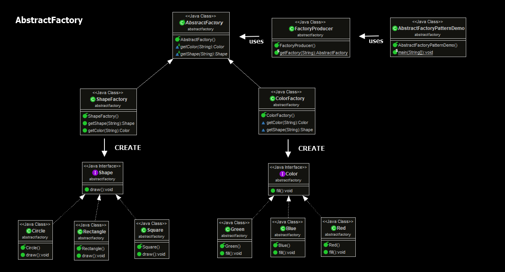
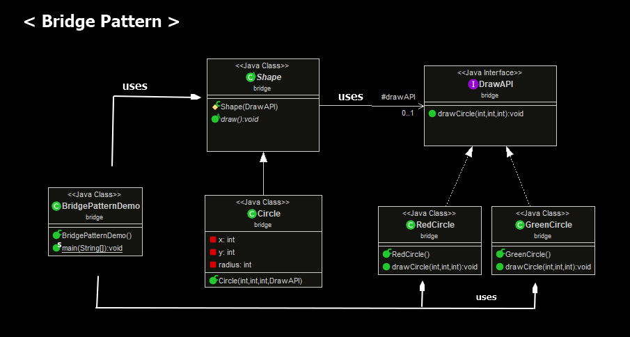
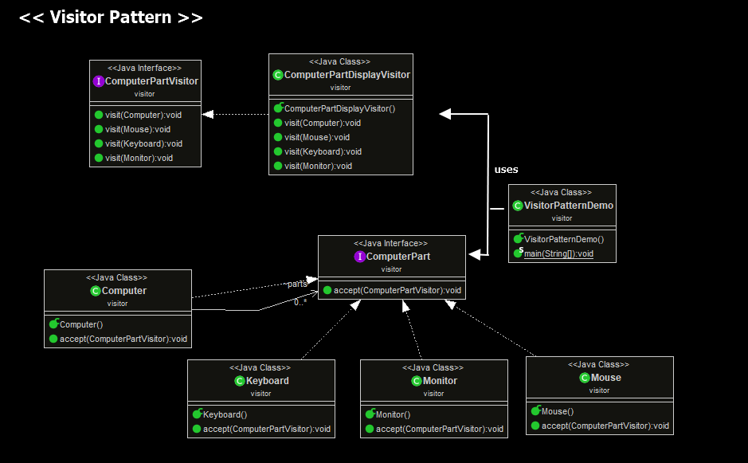
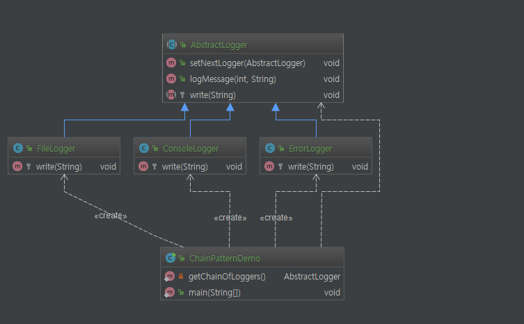
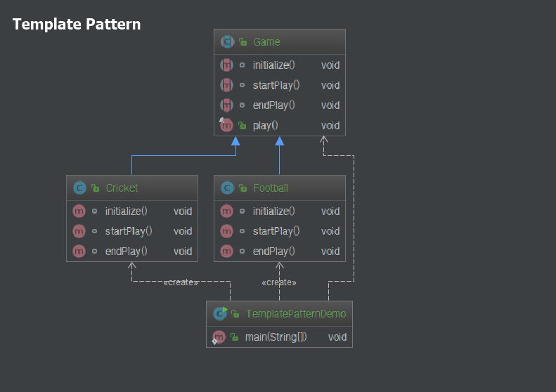

# Designpattern Tutorial

[tutorialspoint](https://www.tutorialspoint.com/design_pattern)


# Factory Pattern

[[source code]](https://github.com/zacscoding/DesignPatterns/tree/master/design-pattern-tutorial/src/factory)



```factory.*```

---

# Abstract Factory Pattern
; 구체적인 클래스를 지정하지 않고 관련성을 갖는 객체들의 집합을 생성하거나  
서로 독립적인 객체들의 집합을 생성할 수 있는 인터페이스를 제공하는 패턴

[[source code]](https://github.com/zacscoding/DesignPatterns/tree/master/design-pattern-tutorial/src/abstractfactory)  



```abstractfactory.*```

---

# Singleton Pattern
; 어떤 클래스의 인스턴스는 오직 하나임을 보장 & 이 인스턴스에 접근할 수 있는  
전역적인 접촉점을 제공하는 패턴

[[source code]](https://github.com/zacscoding/DesignPatterns/tree/master/design-pattern-tutorial/src/singleton)  

```singleton.*```

---

# Bridge Pattern
; 구현부에서 추상층을 분리하여 각자 독립적으로 변형할 수 있게 하는 패턴

[[source code]](https://github.com/zacscoding/DesignPatterns/tree/master/design-pattern-tutorial/src/bridge)



```bridge.*```

---

# Visitor Pattern
; 객체 구조를 이루는 원소에 대해 수행할 연산을 표현하는 패턴으로,  
연산을 적용할 원소의 클래스를 변경하지 않고도 새로운 연산을 정의할 수 있게 함

[[source code]](https://github.com/zacscoding/DesignPatterns/tree/master/design-pattern-tutorial/src/visitor)

```visitor.*```



---

# Chain of responsibility Pattern
;

[[source code]](https://github.com/zacscoding/DesignPatterns/tree/master/design-pattern-tutorial/src/chainofresponsibility)

```chainofresponsibility.*```



---

# Template
;

[[source code]](https://github.com/zacscoding/DesignPatterns/tree/master/design-pattern-tutorial/src/template)

```template.*```



---
